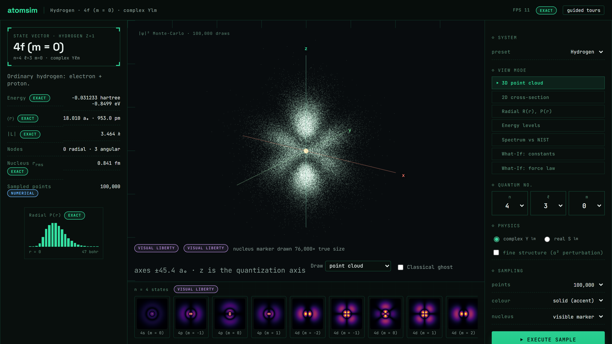
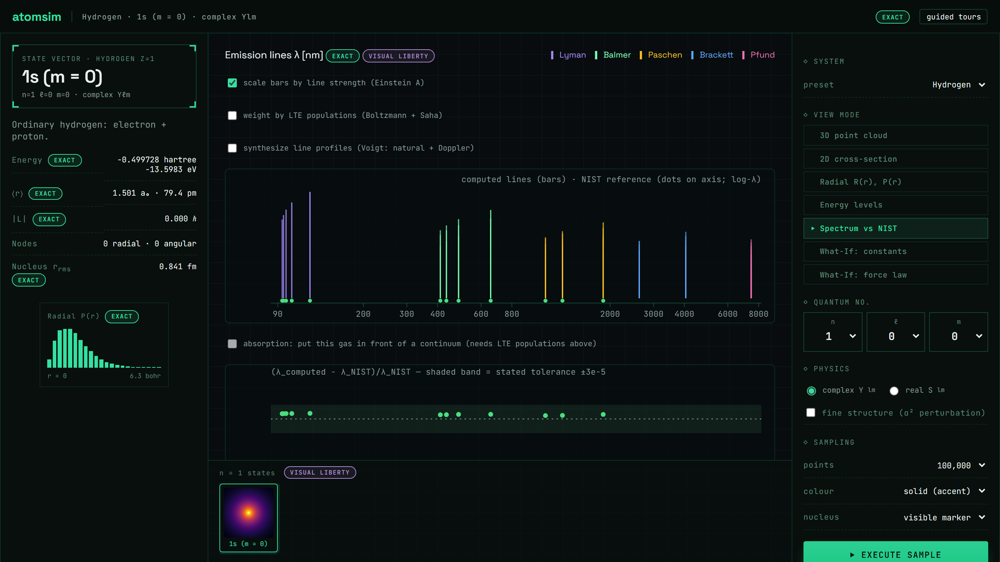
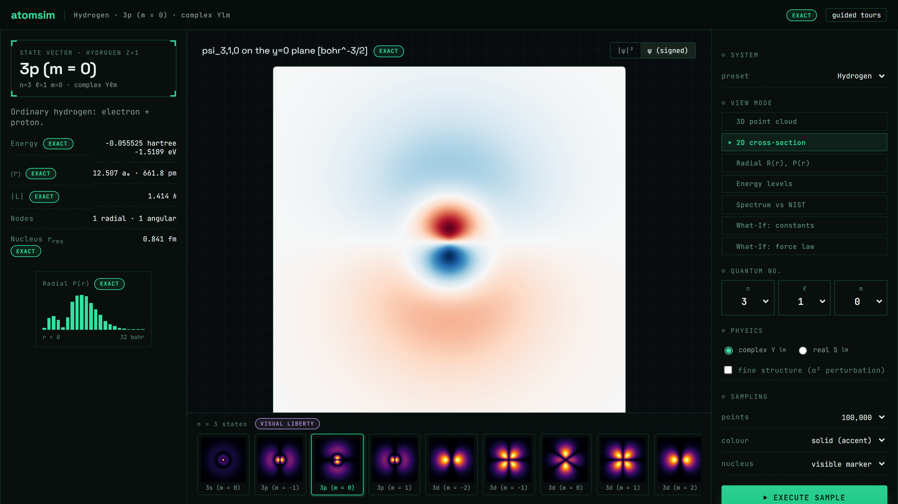

# AtomSim

**A quantum-mechanical atom model that never quietly lies about its physics.**

[](https://github.com/yaasshh09/AtomSim/actions/workflows/ci.yml)
[](https://www.python.org/)
[](LICENSE)

A hand-written atomic-physics engine and the instrument that reads it. Solve
hydrogen in closed form, run self-consistent Hartree-Fock on real atoms,
compare the resulting spectrum against NIST, then break the rules on purpose
and watch what the altered physics actually does.



## The prime directive

Every physical value that crosses a module boundary carries a `Provenance`
saying how it was obtained. Not a comment, not documentation: a data structure
the engine threads through the server and out to the browser, where the UI
renders it as a badge you can click.

| Tier | Meaning |
|---|---|
| `EXACT` | Closed-form solution of the stated model |
| `NUMERICAL` | Converged numerical solution, with quantified error |
| `APPROXIMATION` | Honest simplified model, assumptions stated |
| `COUNTERFACTUAL` | Deliberately altered physics, computed rigorously under the new rules |
| `VISUAL LIBERTY` | A presentational choice with no physical content, disclosed |

The rule is narrow and strict. A plain `float` crossing a boundary, a silent
zero, an undisclosed presentational choice: all bugs. When the nucleus gets
drawn 76,000 times its true size so you can see it at all, the picture says so.

## What it computes

**One electron, exactly.** Analytic hydrogen-like states for any Z, with the
reduced mass done properly. That one detail hands you deuterium and tritium
isotope shifts, muonic hydrogen, positronium, and hydrogenic ions out of the
same formulas. Complex `Y_lm` and real chemistry orbitals are both first-class,
and which basis you're looking at is part of the provenance.

**Beyond the gross structure.** Perturbative fine structure (spin-orbit,
relativistic kinetic, Darwin), the exact Dirac solution to compare it against,
hyperfine splitting including the 21 cm line, and Zeeman and Stark effects with
the full Breit-Rabi crossover.

**Many electrons.** A hand-written radial Hartree-Fock stack on an exponential
mesh: self-consistent, no fitted parameters, good for neutral atoms through
argon and ions past it. Next to it sits a GSZ screened-potential model covering
15 of those elements, so you can put two different approximations of the same
atom on one axis and see exactly where they part ways.

**Light.** Transition strengths from dipole matrix elements (oscillator
strengths, Einstein A, lifetimes) with a Wigner 6j engine for j-resolved rates,
LTE level populations via Boltzmann and Saha, Voigt line profiles, optical
depth and the curve of growth, and synthetic absorption spectra.

**The What-If Lab.** Vary ℏ, e, mₑ, ε₀, or c and watch which dimensionless
combinations actually moved. Double e while quadrupling ε₀ and nothing
observable changes at all, which is the whole lesson. Swap the Coulomb law for
Yukawa, a power law, a harmonic well, or an expression you type in yourself.
Switch off exchange. Switch off Pauli exclusion and watch chemistry collapse
into 1s^N. Each of these computes the real consequences of the broken rule,
under a `COUNTERFACTUAL` banner.

<table>
<tr>
<td width="50%"></td>
<td width="50%"></td>
</tr>
<tr>
<td>Computed lines against vendored NIST reference data, with the fractional residual against the stated tolerance underneath.</td>
<td>ψ is real on the y=0 plane, so a signed plot is honest there. On any other plane it wouldn't be, and the caption tells you which one you're looking at.</td>
</tr>
</table>

## Validation is the feature

The test suite is the argument that the physics is real. It's written to be
read as evidence, not counted as coverage:

- The numerical solver is checked against closed-form hydrogen at production
  grid resolution, with stated tolerances, plus normalization, orthogonality,
  node counts, virial theorem, and hydrogenic ⟨r⟩ formulas.
- Monte-Carlo sampling is validated by Kolmogorov-Smirnov tests against the
  analytic CDFs, not by eyeballing a picture.
- Grid-dependent results assert a **convergence rate** under grid halving, not
  a tolerance a finer mesh could accidentally satisfy.
- Computed spectra are compared against vendored NIST Atomic Spectra Database
  values (H, D, He, Li, Na) with citation and retrieval date in-repo. No live
  queries, so the comparison is reproducible.
- Hartree-Fock energies are checked against published reference values.

That comparison runs inside pytest, which means **a physics regression fails
CI**, on every push, on a Windows runner.

## Quickstart

Windows-native, no WSL. Prerequisites are in [docs/SETUP.md](docs/SETUP.md).
From the Miniforge Prompt, in a clone of this repo:

```
conda env create -f environment.yml
conda activate atomsim
powershell -ExecutionPolicy Bypass -File scripts\setup_web_node_modules.ps1
cd web && npm ci && npm run build && cd ..
atomsim serve
```

`atomsim serve` only mounts the app if `web/dist` exists, so rebuild the
frontend after changing anything under `web/src`.

Every state is addressable by URL, so any moment of a session is shareable:
`?n=3&l=1&m=-1&system=mu-h&view=plane&plane=psi`.

Run the suites with `pytest` from the repo root and `npm test` from `web/`.

The rest of the documentation is indexed in [docs/](docs/README.md): setup and
deployment guides, plus the design record, where every phase has a spec saying
what got built and why, and a plan saying how.

## License

MIT
